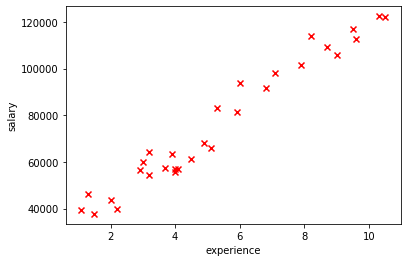

# Linear Regression
* Linear regression is a linear model that assumes a linear relationship between the input variables (x)
and the single output variable.

  * Data

    
  
  * Linear Model

    
