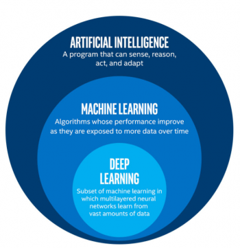
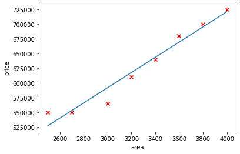
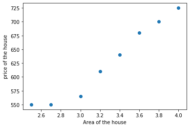
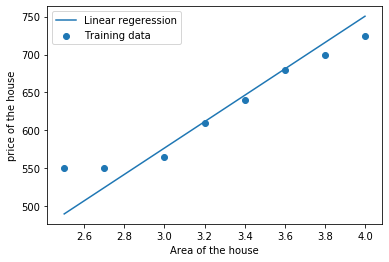
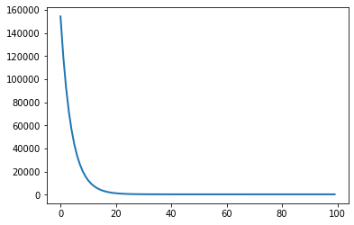
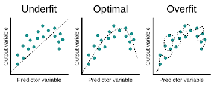
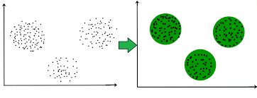

These are the materials and resources for my webinar on [Machine learning and Deep learning](https://bharathikannann.github.io/blogs/machine-learning-and-deep-learning-webinar/).<br>
Webinar video - [link](https://youtu.be/9wVjTK6Fv1k?t=3)<br>
About this webinar - [link](intro.md)<br>
My personal blog page - [link](bharathikannann.github.io/blogs)

# `Machine Learning and Deep Learning`

## Table of contents

- [Machine Learning](#machine-learning)
	- [Machine Learning Algorithms](#machine-learning-algorithms)
	- [Supervised Learning](#supervised-learning)
		- [Linear Regression](#linear-regression)
			- [Hypothesis Function](#hypothesis-function)
			- [Cost Function](#cost-function)
			- [Gradient Descent](#gradient-descent)
			- [Linear Regression from scratch in python](#linear-regression-from-scratch-in-python)
			- [Multiple Variables](#multiple-variables)
			- [Polynomial Regression](#polynomial-regression)
		- [Logistic Regression](#logistic-regression)
		- [One Vs All](#one-vs-all)
		- [Regularization](#regularization)
		- [Vectorization](#vectorization)
	- [Unsupervised Learning](#unsupervised-learning)
		- [Clustering](#clustering)
		- [Application](#application)
	- [Reinforcement Learning](#reinforcement-learning)
- [Deep Learning](#deep-learning)
	- [Neural Networks](#neural-networks)
		- [Neural Networks from scratch in python](#neural-networks-from-scratch-in-python)
	- [Convolutional Neural Networks](#convolutional-neural-networks)
	- [Recurrent Neural Networks](#recurrent-neural-networks)

## Artificial Intelligence
> **Artificial intelligence (AI) is the broad science of mimicking human abilities, machine learning is a specific subset of AI that trains a machine how to learn.**

<p align="center"></p>

## `Machine Learning`

> **Machine learning is a field of study that gives computers the ability to learn without being explicitly(clearly) programmed.**

- Machine learning techniques are used to automatically find the **valuable underlying patterns within complex data** that we would otherwise struggle to discover. The hidden patterns and knowledge about a problem can be used to **predict future events** and perform all kinds of complex decision making.

- Tom Mitchell provides a more modern definition: `“A computer program is said to learn from experience E with respect to some class of tasks T and performance measure P, if its performance at tasks in T, as measured by P, improves with experience E.`


## `Machine Learning Algorithms`

- **Supervised Learning** 
- **Unsupervised Learning**
- **Reinforcement Learning**

## `Supervised Learning`

- Supervised learning is when the model is getting trained on a labelled dataset.
- Labelled dataset is one which have both input and output parameters.

#### Example
- Given data about the area of houses and their price, try to predict their price for new area.

## Types of supervised learning
- `Regression`
- `Classification`

### Regression
- Here we are trying to predict results within a continuous output, meaning that we are trying to map input variables to some continuous function.
- Given a picture of a person, We have to predict his/her age(Continuous).

### Classification
- Here we are trying to map input variables into discrete categories. 
- Given a picture of a person, We have to predict their gender (Male/Female) (Discrete).

## Regression

## `Linear Regression`

> Linear regression attempts to model the relationship between two variables by fitting a linear equation to observed data.

<p align="center"></p>

- Training Dataset
- X - input
- Y - output
 <div>
	<center>
		<table style="padding-left: 100px;">
			<tr>
			    <th>X(area)</th>
			    <th>Y(price)</th>
			</tr>
		  	<tr>
			    <td>2500</td>
			    <td>550000</td>
		  	</tr>
		  	<tr>
			    <td>2700</td>
			    <td>550000</td>
		  	</tr>
		  	<tr>
			    <td>3000</td>
			    <td>565000</td>
		  	</tr>
		</table>
	</center>
</div>

## `Hypothesis Function`

- Our hypothesis function
	- `Prediction ​= weight * x + bias`
- Example
	- Prediction = weight * (2800)  + bias​

## `Cost Function`

- Accuracy of our hypothesis function can be measured by using cost function.

- A Cost function basically tells us *how good our model is at making predictions* for a given value of weight and bias.

- **Formula**
	> - Cost(weight , bias) = `𝟏/𝟐𝒎 ∑(𝒊=𝟏)^𝒎[[(𝑯𝒚𝒑𝒐𝒕𝒉𝒆𝒔𝒊𝒔(𝒙_𝒊)−𝒚_𝒊)]^𝟐 ]`
	- `m` - Number of training examples.
	- `𝐻𝑦𝑝𝑜𝑡ℎ𝑒𝑠𝑖𝑠 𝑥_𝑖 − 𝑦_𝑖` - Difference of Predicted and Original value.

- This takes an average of all the results of the hypothesis to the actual output y's.
- Our objective is to get the best possible line. The best possible line will be such so that the average squared vertical distances of the scattered points from the line will be the **least**.

### Our Goal
- `minimize(cost(weight,bias))`

## `Gradient Descent`
- Gradient descent is an optimization algorithm used to find the values of parameters (coefficients) that minimizes a cost function.
> There are two things that you should know to reach the minima.
> **which way to go and how big a step to take.**

- We can use gradient descent to do this with the use of derivatives effectively.
- A derivative is the slope of a graph at any given point and it will give us the direction to move towards.

- **Learning Rate(∝)**
	> The size of steps taken to reach the minimum is called learning rate.
	- If we use higher learning rate it will move larger steps but there is a risk of overshooting the minima.
	- If we use lower learning rate it will take more steps to converge.
	- ∝ is a **hyperparameter**
	- Try Experimenting with it
		- [Source](https://developers.google.com/machine-learning/crash-course/fitter/graph)

- **Algorithm** 

	- <p align="center"></p>

	> - weight := weight - learning_rate * differentiation of cost with respect to weight
	> - bias := bias - learning rate * differentiation of cost with respect to bias

	- if the derivative(slope) is positive then subtracting it will decrease the weight so it will move towards minima.
		- `w:=w-learning_rate * (positive slope) here w will decrease.`
	- if the derivative(slope) is negative the subtracting it will increase the weight si it will move towards minima. 
		- `w:=w-learning_rate * (negative slope) here w will increase.`
	- same as for bias

## `Linear Regression from scratch in python`
- For complete code
	- refer here - https://github.com/bharathikannan1311/Python/tree/master/Webinar/LinearRegressionfromscratch

### Implementation
- Importing the libraries
```python
import numpy as np
import pandas as pd
import matplotlib.pyplot as plt
```
- Reading the csv file
```python
data = pd.read_csv("Price_Predection.csv")
```

- Splitting the data
```python
X = data["area(1000m2)"]
y = data["price(1000$)"]
```

- Plotting the data
```python
plt.scatter(X,y)
plt.xlabel("Area of the house")
plt.ylabel("price of the house")
```

<p align="center"></p>

- We add another dimension to our data to accommodate the (bias)  intercept term so that it will be easy for vectorization.
```python
m=len(X) # length of the training example
X = np.stack([np.ones(m), X],axis = 1)
```

- **Cost Function**
- Cost(theta) = `𝟏/𝟐𝒎 ∑(𝒊=𝟏)^𝒎[[(𝑯𝒚𝒑𝒐𝒕𝒉𝒆𝒔𝒊𝒔(𝒙_𝒊)−𝒚_𝒊)]^𝟐 ]`
	- theta is a vector of [theta_0 and theta_1]
	- hypothesis = theta_0 + x * theta_1
	- theta_0 represents bias
	- theta_1 represents weight
```python
def computeCost(X,y,theta):
    m = y.size
    J = 0
    #vectorized Implementation
    J = (1/(2 * m)) * np.sum(np.square(np.dot(X, theta) - y))
    return J
```

- **Gradient Descent**
	- theta_j := theta_j - learning_rate * differentiation of cost with respect to theta_j
	- where j=0,1
	- With each step of gradient descent, your parameters  theta_j  come closer to the optimal values that will achieve the lowest cost J(theta).
```python
def gradientDescent(X, y, theta, alpha, num_iters):
    m = y.size
    theta = theta.copy()  
    J_history = []  
    for i in range(num_iters):
        #Vectorized Implementation 
        theta = theta - (alpha / m) * np.dot((np.dot(X, theta) - y),X)
        J_history.append(computeCost(X, y, theta))    
    return theta, J_history
```

- Our Linear Regression model
```python
#initialiing theta to zeros
theta = np.zeros(2)
iterations = 100
alpha = 0.01

theta, J_history = gradientDescent(X ,y, theta, alpha, iterations)
```

- Predection for our model
```python
np.dot([1,2.5],theta)
```

- Plotting our model
```python
plt.scatter(X[:,1],y)
plt.xlabel("Area of the house")
plt.ylabel("price of the house")
plt.plot(X[:, 1], np.dot(X, theta))
plt.legend(['Linear regeression', 'Training data']);
```

<p align="center"></p>


- Visualizing our cost function
```python
plt.plot(np.arange(len(J_history)), J_history, lw=2)
```

<p align="center"></p>


## `Multiple Variables`
<div>
	<center>
		<table style="padding-left: 100px;">
			<tr>
			    <th>X1(area)</th>
			    <th>X2(age)</th>
			    <th>Y(price)</th>
			</tr>
		  	<tr>
			    <td>2500</td>
			    <td>10</td>
			    <td>550000</td>
		  	</tr>
		  	<tr>
			    <td>2700</td>
			    <td>20</td>
			    <td>550000</td>
		  	</tr>
		  	<tr>
			    <td>3000</td>
			    <td>15</td>
			    <td>565000</td>
		  	</tr>
		</table>
	</center>
</div>

- **Hypothesis**
	- **Prediction = weight1 * x1 +weight2 * x2+ bias**

- **Example**
	- Prediction = weight1 * (2800)  weight2 * (10) + bias​


## `Polynomial Regression`

- Polynomial Regression is a form of linear regression in which the relationship between the independent variable x and dependent variable y is modeled as an nth degree polynomial.
	- **Hypothesis**
		- Prediction ​= weight1 * x +weight2 * 𝒙^𝟐 + bias

	- **Example**
		- Prediction = weight1 * (2800)  weight2 * [𝟐𝟖𝟎𝟎]^𝟐 + bias​

## Classification

## `Logistic Regression`

> Logistic regression is used when the response variable is categorical in nature.

<p align="center"></p>

- Example :
    - Spam/Not spam
    - Win/Lose
    - Pass/Fail
- Classification : Output={0,1}

- Example Dataset

<div>
	<center>
		<table style="padding-left: 100px;">
			<tr>
			    <th>X1(area)</th>
			    <th>X2(price)</th>
			    <th>Y(sell/Not sell)</th>
			</tr>
		  	<tr>
			    <td>2500</td>
			    <td>550000</td>
			    <td>0</td>
		  	</tr>
		  	<tr>
			    <td>2700</td>
			    <td>550000</td>
			    <td>1</td>
		  	</tr>
		  	<tr>
			    <td>3000</td>
			    <td>565000</td>
			    <td>1</td>
		  	</tr>
		</table>
	</center>
</div>

- **Hypothesis**
	- Output should be in range (0<= z <=1)
	> Hypothesis = sigmoid(weight1 * x1+ weight2 * x2 + bias)
	- Where Sigmoid(z) = 1/(1+𝑒^(−𝑧))

	- In order to get our discrete 0 or 1 classification, we can translate the output of the hypothesis function as follows:
	- Hypothesis ≥ 0.5 → y=1
	- Hypothesis < 0.5 → y=0

## `One vs All`

- If we have a classification problem and there are N distinct classes. In this case, we'll have to train a multi-class classifier instead of a binary one. 
- One-vs-all classification is a method which involves **training N distinct binary classifiers**, each designed for recognizing a particular class.

<p align="center"></p>

## `Regularization`

- Regularization is designed to address the problem of overfitting.
- We will come across a situation where your model performed exceptionally well on train data, but was not able to predict test data.

- **Formula**
	- Cost(weight , bias) = `𝟏/𝟐𝒎 ∑(𝒊=𝟏)^𝒎[[(𝑯𝒚𝒑𝒐𝒕𝒉𝒆𝒔𝒊𝒔(𝒙_𝒊)−𝒚_𝒊)]^𝟐 ] + (lambda/(2*m)) * ∑||w^2|| `
	- lambda is a hyperparameter
- The additional term controls the excessively fluctuating function such that the coefficients don't take extreme values. 

<p align="center"></p>

## `Vectorization`

- Vectorization is the process of converting an algorithm from operating on a single value at a time to operating on a set of values (vector) at one time.
- **Vectorized Implementation of cost function**
```python
	J = (1/(2 * m)) * np.sum(np.square(np.dot(X, theta) - y))
```

- **Non Vectorized Implementation**
```python
	k=0 #considering second matrix as vector
	result=list()
	for i in range(2): #no of rows in l1 matrix
	    ans=0
	    for j in range(2): #no of columns in l1 matrix
		ans=ans+l1[i][j]*l2[j][k]
	    result.append((ans-l3[i][k])**2)
	J = (1/(2 * m)) * sum(result)
```

## `Unsupervised Learning`

- Unsupervised learning allows us to approach problems with little or no idea what our outputs should look like.
- Unsupervised Learning algorithms will help find structure or patterns in the underlying data.
- Example
	- Social Network Analysis
	- Astronomical Data Analysis

## `Clustering`

<p align="center"></p>

- **K Means Algorithm**
	- It finds a fixed number (k) of clusters in a set of data.
	- Randomly initialize points in the dataset.
	- Assign all examples into one of the groups based on which cluster centroid the example is closest to.
	- Compute the averages for all the points inside each of the clusters centroid groups, then move the cluster centroid points to those averages.
	- Repeat the above 2 steps

### Application

- **Image Compression**
	- refer here - https://github.com/bharathikannan1311/Python/tree/master/Webinar/ImageCompression

## `Reinforcement Learning`
> The system takes a decision, learns from the feedback and takes better decisions in the future.
- It is about taking suitable action to maximize reward in a particular situation. In the absence of a training dataset, it is bound to learn from its experience.

<p align="center"></p>

- Example: 
	- We have an agent and a reward, with many hurdles in between.

- **Applications**
	- Robotics
	- Self driving cars
	- Manufacturing

- **Google Atari breakout**
	- DQN(Deep Q-Network) finds and exploits the optimal strategy in this game, which is to make a tunnel around the side, and then allow the ball to hit blocks by bouncing behind the wall.
	- [source](https://www.youtube.com/watch?v=TmPfTpjtdgg)
- **Google Deepmind Alpha Go**
	- AlphaGo is the first computer program to defeat a professional human Go player, a landmark achievement that experts believe was a decade ahead of its time.
	- [Documentary](https://www.youtube.com/watch?v=WXuK6gekU1Y)
- **Multi-Agent Hide and Seek**
	> We’ve observed **agents discovering progressively more complex tool** use while playing a simple game of hide-and-seek. Through training in our new simulated hide-and-seek environment, **agents build a series of six distinct strategies and counterstrategies**, some of which we did not know our environment supported. The self-supervised emergent complexity in this simple environment further suggests that multi-agent co-adaptation may one day produce extremely complex and intelligent behavior. - **by Open AI**
	- [source](https://www.youtube.com/watch?v=kopoLzvh5jY)

# `Deep Learning`
- Deep learning is a branch of machine learning which is completely based on artificial neural networks.
> Neural Network is going to mimic the human brain.

<p align="center"></p>

## `Neural Networks`
- Neural networks are used to solve complex problems people face in real-world situations. These networks can learn and model the relationships between inputs and outputs that are complex and nonlinear.

<p align="center"></p>

- **Neural Network Structure**
	- [source](https://developers.google.com/machine-learning/crash-course/introduction-to-neural-networks/anatomy)
- **Tensorflow playground**
	- [source](https://playground.tensorflow.org/#activation=tanh&batchSize=10&dataset=circle&regDataset=reg-plane&learningRate=0.03&regularizationRate=0&noise=0&networkShape=4,2&seed=0.73792&showTestData=false&discretize=false&percTrainData=50&x=true&y=true&xTimesY=false&xSquared=false&ySquared=false&cosX=false&sinX=false&cosY=false&sinY=false&collectStats=false&problem=classification&initZero=false&hideText=false)

### `Neural Networks from scratch in python`
- refer here - https://github.com/bharathikannan1311/Python/tree/master/ML/Neural%20Networks

- **Applications**
	- Financial Forecasting
	- Targeted Marketing

## `Convolutional Neural Networks`
> Convolutional neural network is most commonly applied to analyzing visual imagery.
- CNN is more efficient in terms of memory and complexity. Imagine NNs with billions of neurons, then CNNs would be less complex and saves memory compared to the NN.

<p align="center"></p>

- **Live demo**
	- [source](http://poloclub.github.io/cnn-explainer/)

- **Excel Demo by fastai**
	- [source](https://github.com/fastai/fastai/tree/master/courses/dl1/excel)

- **Applications**
	- Face recognition.
	- Image classification.
	- Human pose estimation.
	- Document analysis.

## `Recurrent Neural Networks`
>  In traditional neural networks, all the inputs and outputs are independent of each other, but in cases like when it is required to predict the next word of a sentence, the previous words are required and hence there is a need to remember the previous words.
- The main and most important feature of RNN is Hidden state, which remembers some information about a sequence.

<p align="center"></p>

- **Applications**
	- Language Modelling and Generating Text.
	- Machine Translation.
	- Speech Recognition.
	- Generating Image Descriptions.


### References

- [Machine Learning](https://www.coursera.org/learn/machine-learning) course by Andrew NG (coursera)
- [Deep Learning Specialization](https://www.coursera.org/specializations/deep-learning) by Andrew NG (coursera)
- Blogs - [Towardsdatascience.com](https://towardsdatascience.com/machine-learning/home)
- [Machine Learning crash course](https://developers.google.com/machine-learning/crash-course/ml-intro) from google
- [Code template](https://github.com/dibgerge/ml-coursera-python-assignments) - Github
- [Images](https://github.com/bharathikannan1311/Python/tree/master/Webinar/Images) - taken from multiple sources credit goes to respective owners. If any issues please contact me at **bharathikannan1311@gmail.com**.
	- and many other references
